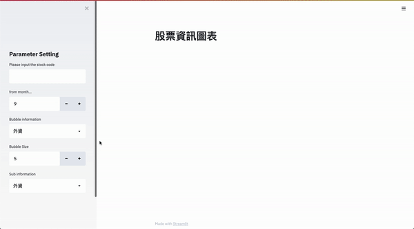

# Stock-Streamlit

These is a project about stock analysis using by [steamlit](https://github.com/streamlit/streamlit) and [twstock](https://github.com/mlouielu/twstock).

## Environment
- python 3.8.2
- streamlit 0.73.1
- twstock 1.3.1
- plotly 4.14.1
- pandas 1.1.5

## Usage
```bash
streamlit run app.py
```

To debug the StockInfo class, you can use:
```bash
python stock.py
```

## Demo


---
Modify from [Streamlit_stock_chart](https://github.com/neutron0916/Streamlit_stock_chart), and thanks for original author sharing!